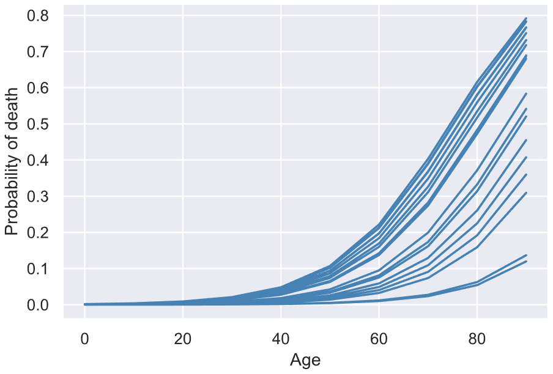
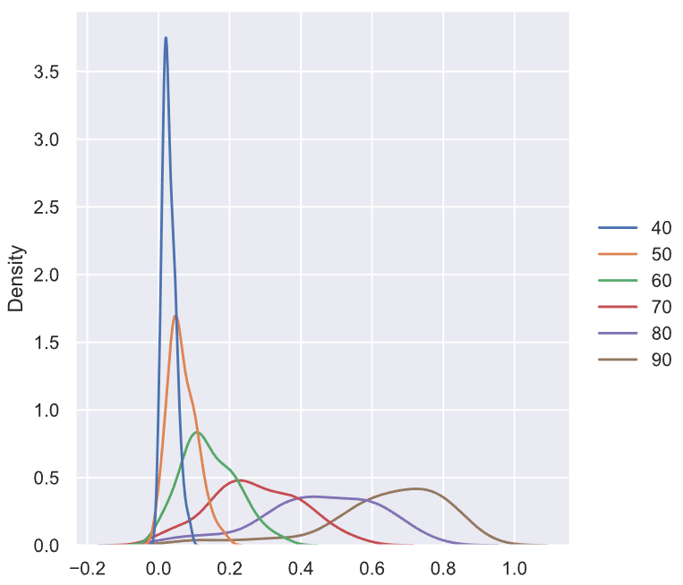
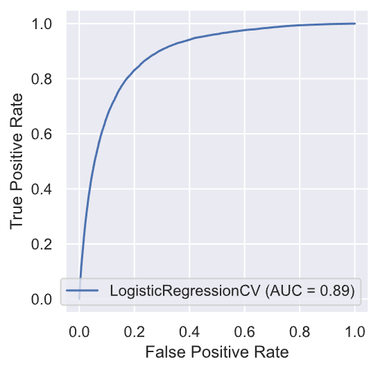

# IRisk Lab: AI-Powered Socioeconomic Prediction of Lifespan

This repository contains exploratory code and documentation for my research on lifespan prediction during the fall of 2020 at the [Illinois Risk Lab](https://irisklabuiuc.wixsite.com/actsi/associates).

__Abstract__: How long will you live? This age-old question has extensive implications in the billions of risk estimations made by individuals planning for the future every day. Although never certain, a stronger approximation of an indidual's lifespan can enable more reliable future planning and a greater sense of stability than none at all. We reviewed publicly available datasets containing socioeconomic information about U.S. citizens to create a naïve model that predicts the likelihood of a person's death at different ages given characteristics such as location, income, place of birth, and more. The results are explained and visualized in this report. While more work must be done to achieve a more accurate predictor, this work provides a baseline for lifespan prediction in coordination with other financial models to aid financial planning. 

Please see `final-report/report.pdf` for a complete summary of my work. 

## Tools
- [Scikit-learn](https://scikit-learn.org/stable/)
- [LightGBM](https://github.com/microsoft/LightGBM)
- [Imblearn](https://imbalanced-learn.readthedocs.io/en/stable/index.html)
- [U.S. Census and CDC datasets](https://biolincc.nhlbi.nih.gov/studies/nlms/)
- [HAL Supercomputing Cluster at the National Center for Supercomputing Applications](https://wiki.ncsa.illinois.edu/display/ISL20/HAL+cluster)

## Sample Plots

### Sample of Mortality Probability Distributions

### Probability Density Plot by Age for Overall Prediction

### ROC Curve from Logistic Regression
