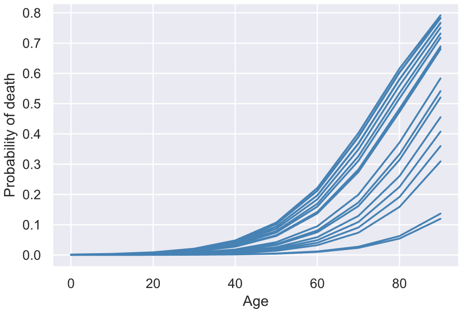
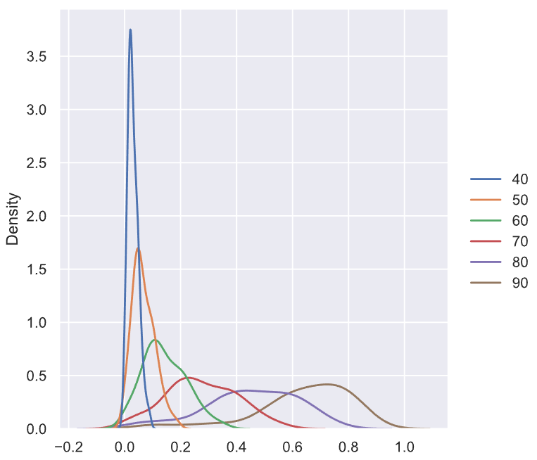

<!-- Document -->

# Background

## Desired Features

Lifespan prediction is important to a broad variety of scientific and industrial fields. Each field in which it is relevant requires a different scope, accuracy, and set of input features. For example, the medical field might look at a patient's weight and blood pressure to determine their risk of passing away from heart disease. Millions of specific, dynamic variables affect an individual's lifespan, ranging from minute physical details to sociological environments to occupational conditions. Naturally, it is currently impossible to accurately measure all of these variables for an individual, let alone every individual. Thus, we must let the domain of our application dictate which variables we use, as well as the size and diversity of the dataset we use to predict lifespan. 

If we were to make a perfect predictor of mortality, some of the high-level features we might consider include: 

- General biographical information (e.g. age, sex)
- Location 
- Occupational and residential environment conditions
- Income
- Medical information

In particular, the most likely available features would fall into the groups of socioeconomic and medical. Unfortunately, in our dataset search, finding a dataset that combined socioeconomic status, medical information, and lifespan information was difficult to come by. There are datasets linking two of those three features, but a comprehensive, large scale study documenting all three with useful sample sizes was not found. As a result, some compromises had to be made in favoring the socioeconomic data over medical data, as that is more relevant and available in actuarial settings. 

## Dataset Selection

### CDC Dataset

The first dataset that we attempted to use was the Mortality Multiple Cause-of-Death dataset created by the U.S. Center for Disease Control (CDC)[^1]. While this dataset contained several of the features that we wanted to include in our analysis, it was still missing a lot of the socioeconomic factors that we were looking for and the medical information it contained was difficult to parse. After a few weeks of attempting to work with this data, we decided to search for a new dataset that better matched the needs of the research. 

### NLMS Dataset

The best dataset that we found within our timeframe was from the National Longitudinal Mortality Study (NLMS) created by the United States Census Bureau[^2]. The dataset is not available for direct online download, so we requested the data from the Bureau through a short application that was approved. The NLMS dataset contained over 40 features including many of the socioeconomic features that we were looking for. Unfortunately, the medical data provided by the dataset was mostly limited to medical causes of death, which are of dubious explanatory integrity when attempting to predict lifespan. A sample of the features used in the analysis is detailed below: 

- Age
- Number of household members
- Inflation-adjusted income
- Income relative to poverty line
- State of residence and urban/rural classification
- Race
- Sex
- Occupation categories

Each entry had a corresponding weight. The purpose of the weight was to attempt to account for oversampling or undersampling of specific demographic populations in the United States, as the NLMS study was a conglomeration of smaller field surveys. The dataset was available in several forms, including a separate dataset solely for the purpose of tracking deaths of people who smoked. 

# Preprocessing 

After selecting the dataset, we began the steps of preprocessing the data for model creation. A number of steps that were taken have been omitted from this summary, some of which were kept and some of which were discarded through the research process. 

Roughly half of the variables in the NLMS dataset had very high missing rates. Although tactical imputation can be used for values with medium levels of missing data, many of these features were missing more than half of their entries. Simply removing all entries with missing values would shrink the dataset tenfold and very likely skew the data, so I instead opted to drop features with high missing rates. The cutoff point identified was that features with `>20%` of their data missing were removed. The remaining missing values were much easier to handle and discard. 

The features related to smoking were removed because they were almost entirely absent from this dataset and were meant for use in a separate, compatible dataset. A more robust iteration of this research may desire to make use of these smoking datasets, but they were not included in this analysis. 

The categorical features in the dataset were converted to binary dummy variables in which a number of columns equal to the number of unique categories in feature is created with a `1` in the column for every entry that contained the corresponding category for that feature and a `0` in all other entries.  

The response variable, mortality within the 10-year follow-up periods of the study in the dataset, was present in two separate features, `indalg` and `inddea`. These represent two different ways that the NLMS dataset identified deaths. At the recommendation of the reference manual attached to the data, we combined the two features with an inner merge into one named `indmort` and only counted deaths that were present in both categories. 

The appendix of this report contains the code for training the model and saving the results in a file. It does not include the code for statistical plots. 

# Modeling

The preprocessed data was then used to fit multiple models with the objective of predicting mortality likelihood at different ages of individuals on a macroscopic scale. The two models used were `LogisticRegressionCV` from the `scikit-learn` package[^3] and `LGBMClassifier` from Microsoft's LightGBM package[^4]. 

## Oversampling

The mortality data from our dataset was naturally highly imbalanced. Over the 10-year follow-up period, there existed a ratio of approximately 19 survivals for each death. This can cause binary classification models to underfit the data and simply classify every survival and death entry as a survival, therefore reaching a ~95% accuracy. To combat this, we used the Synthetic Minority Oversampling Technique (SMOTE) from the `imblearn` library[^5]. After splitting the data into a large training and small testing subset, the technique is applied only to the training data. This resamples and imputes the training data so that it shifts to a 1:1 death to survival ratio, allowing the classification model to more accurately discern deaths when scored on the test data. 

## Models

Both models took in a DataFrame of solely numeric features (categorical variables having been dummified) and a binary target array representing death or survival during the 10-year follow-up period of the study. 

The LightGBM classifier is a tree-based model that outputs binary probabilities. The logistic regression is a linear-based standard model with parameters specified in the code. 

Each model was trained using cross validation and hyperparameter optimization over a feature space defined in the included code. The models were trained over 150 iterations of the optimization and results were saved in `.csv` and `.pkl` files. 

## Metrics

The models were evaluated on several metrics. The precision, recall, and F1 score (weighted average of precision and recall) of each model's predictions on test data were compared. Despite the improved performance of the model from the application of SMOTE, the F1 scores of the models on death classification were short of 0.5 while the F1 scores on the survival classification were in excess of 0.95. Consideration was also given to the receiver operating characteristic curve and its area (ROC AUC score), with the best model reaching an ROC AUC score of 0.89 after beginning at 0.4 before optimization. The ROC curve of the logistic regression model is shown in Figure 1. A sample of the metrics for the logistic regression model is shown in the appendix. The model's predictions perform best with the addition of a 0.25 constant to the predicted probabilities of the model's output. In risk management, it is conventionally always best to slightly oversave than to undersave, so we prioritized removing false negatives over removing false positives. 


## Hyperparameter Optimization

To finely tune the model, a hyperparameter optimization script was with cross-validation over a feature space of hyperparameters defined in the code. While the hyperparameter optimization failed to produce significant increases in F1 scores on the test data, it led to an increase in the ROC AUC score of roughly 0.42. 

## Computation

To facilitate computation, we used resources from the HAL Cluster provided by the National Center for Supercomputing (NCSA)[^6]. Batch jobs were submitted on the virtual machine using `.swb` files, an example of which is included in the appendix. The training of the LightGBM model with cross-validation and hyperparameter tuning may require over 24 hours, which is the time limit for batch jobs submitted to HAL, so the data from the cross validation procedure should be cached halfway through the process before restarting it with a new job in which the cached data is loaded. 

# Results

After evaluating the models, it remains unclear which model is the best for further use. Both models display similar precision, recall, and F1 scores on test data. While the LightGBM model has a higher ROC AUC score, it takes several days and multiple script batch jobs to complete hyperparameter optimization, while the logistic regression model runs in a few hours. If time and computation resources are not a concern, then it may be better to opt for the LightGBM classification model. 

## Prediction Framework

For the purpose of understanding the model's output and checking them against conventional assumptions, we created a function to which a pandas DataFrame representing a set of individual's data (including dummified categorical variables) is passed and mortality probability predictions are output for each individual at age intervals 10 years apart until age 90, holding all other variables constant. Figure 2 displays a sample output from some of the test data. 



Each line represents a different individual's mortality probability spread. Individuals whose lines fall near the bottom of the distribution are likely subject to socioeconomic conditions that improve quality of life and lengthen lifespan, such as high income, safe areas, and large numbers of household members. Individuals whose lines fall near the top of the distribution and are thus more likely to die at an earlier age are likely subject to the opposite socioeconomic conditions. 



Shown in Figure 3 is a probability density plot for an aggregated collection of the model's output. Ages below 40 are omitted because they are extremely narrow distributions that obscure the wider distributions when displayed on the same plot. At age 40, the distribution is still quite narrow and centered close to zero. This aligns with out expectations of model output. In the United States, death at ages 40 and below is highly unlikely compared to death at later stages in life. For each decade increase, the peak of the probability distribution shifts rightward and downward. The average age of death in the United States is roughly 77, which aligns with our observations from the plot. At age 90, the peak of the distribution has shifted well past 0.5, meaning a majority of people will have died before the age of 90. The peak of the distribution for age 80 is slightly below 0.5, which aligns perfectly with the average age of death, which is slightly below 80. This reality check provides confirmation that the model is outputting reasonably accurate predictions. 

## Limitations 

Several significant drawbacks of our approach to estimating lifespan using this dataset and model are recognized. The data used in the study is collected from a range of time periods in the past half decade, the most recent being 10 years old at the time of the most recent census in 2010. However, mortality rates have not shifted dramatically since then. Additionally, in testing our data, age was held constant while other variables, such as income, were not. This does not follow patterns of lifetime income increase and relocation to which the nation's population is subject. In general, strong assumptions were made about the data and the process that should be revisited if a stronger predictive tool is desired. 

## Future

The models generated as a part of this research are for exploratory and academic purposes only. They should not be taken as highly precise, particularly because lifespan prediction is far from a precise science at its current stage. However, the process documented here may be able to better aid future research that wishes to explore lifespan prediction further an apply it to predictive risk management on a larger scale. 

\newpage
\onecolumn

# Appendix

## Metric Output

| Classification | Precision | Recall | F1 Score | Support |
|----------------|-----------|--------|----------|---------|
| 0.0 (death)    | 0.98      | 0.96   | 0.97     | 429742  |
| 1.0 (survival) | 0.43      | 0.47   | 0.45     | 17154   |
| Accuracy       |           |        | 0.94     | 446896  |
| Macro Avg      | 0.64      | 0.69   | 0.66     | 446896  |
| Weighted Avg   | 0.95      | 0.94   | 0.95     | 446896  |

\newpage

## **`logistic_regression_model.py`** {-}

```{.python .numberLines}
'''Imports'''

import pandas as pd
import numpy as np
import seaborn as sns
import matplotlib.pyplot as plt

from sklearn.linear_model import LogisticRegressionCV
from sklearn.model_selection import train_test_split
from sklearn.metrics import classification_report
from sklearn.metrics import roc_auc_score
from sklearn.metrics import precision_recall_curve

from imblearn.over_sampling import SMOTE

sns.set()

'''Preprocessing'''

df_raw = pd.read_csv('data/11.csv')
print('Data successfully loaded.')

# Drop empty smoking-related columns
df_raw = df_raw.drop(columns=['smok100', 'agesmk', 'smokstat', 'smokhome', 'curruse', 'everuse'])

# Combine mortality columns as specified by reference guide
df_raw['indmort'] = df_raw['inddea'][(df_raw['inddea'] == 1) & (df_raw['indalg'] == 1)]
df_raw['indmort'] = df_raw['indmort'].fillna(0)

# Specify which variables to use in the model by type
used_numerical = ['age', 'hhnum']
used_ordinal = ['povpct', 'adjinc']
used_categorical = ['stater', 'pob', 'sex', 'race', 'urban', 'smsast']
used_special = ['wt', 'indmort']

used_features = used_numerical + used_ordinal + used_categorical + used_special

df_raw = df_raw[used_features]

# Correct datatypes of categorical variables
df_raw[used_categorical] = df_raw[used_categorical].astype('category')

# Drop rows with remaining missing values
df_raw = df_raw.dropna(axis=0)

# Dummify categorical variables
df = pd.get_dummies(df_raw)

# Split data into predictive features and target array
X = df.drop(columns=['indmort'])
y = df['indmort']

'''Sampling'''

# Create test dataset for validation
X_train, X_test, y_train, y_test = train_test_split(X, y)

# Apply Synthetic Minority Oversampling Technique to data
print('Proportion of data from minority class before SMOTE:', y_train.sum() / y_train.shape[0])
X_train, y_train = SMOTE().fit_resample(X_train, y_train)
print('Proportion of data from minority class after SMOTE:', y_train.sum() / y_train.shape[0])

'''Modeling'''

# Train logistic regression model with cross validation
model = LogisticRegressionCV(scoring='roc_auc', random_state=0, n_jobs=-1, verbose=1).fit(X_train.drop(columns=['wt']), y_train, sample_weight=X_train['wt'])

# Generate predictions
pred_probs = model.predict_proba(X_test.drop(columns=['wt']))[:, 1]

# Print model outputs
print(classification_report(pred_probs, y_test))

# The predictions are best when a constant is added to the final probabilities
print(classification_report(np.round(pred_probs + 0.25), y_test, sample_weight=X_test['wt']))
```

\newpage

## **`lightgbm_model.py`** {-}

```{.python .numberLines} 
import pandas as pd
import matplotlib.pyplot as plt
import seaborn as sns
import numpy as np
from sklearn.model_selection import train_test_split
from sklearn.metrics import roc_auc_score
from sklearn.metrics import classification_report
from imblearn.over_sampling import SMOTE
import lightgbm as lgb
import csv
from hyperopt import STATUS_OK, hp, tpe, Trials, fmin
from hyperopt.pyll.stochastic import sample
from timeit import default_timer as timer
import ast
sns.set()

'''Preprocessing'''

df_raw = pd.read_csv('data/11.csv')
print('Data successfully loaded.')

df_raw = df_raw.drop(columns=['smok100', 'agesmk', 'smokstat', 'smokhome', 'curruse', 'everuse'])

df_raw['indmort'] = df_raw['inddea'][(df_raw['inddea'] == 1) & (df_raw['indalg'] == 1)]
df_raw['indmort'] = df_raw['indmort'].fillna(0)

used_numerical = ['age', 'hhnum']
used_ordinal = ['povpct', 'adjinc']
used_categorical = ['stater', 'pob', 'sex', 'race', 'urban', 'smsast']
used_special = ['wt', 'indmort']

used_features = used_numerical + used_ordinal + used_categorical + used_special

df_raw = df_raw[used_features]

df_raw[used_categorical] = df_raw[used_categorical].astype('category')

df_raw = df_raw.dropna(axis=0)

df = pd.get_dummies(df_raw)

X = df.drop(columns=['indmort'])
y = df['indmort']

'''Sampling'''

X_train, X_test, y_train, y_test = train_test_split(X, y)

print('Proportion of data from minority class before SMOTE:', y_train.sum() / y_train.shape[0])
X_train, y_train = SMOTE().fit_resample(X_train, y_train)
print('Proportion of data from minority class after SMOTE:', y_train.sum() / y_train.shape[0])

'''LightGBM Model'''

train_set = lgb.Dataset(X_train, label=y_train)

# The below code is largely borrowed from other subgroups of the AI-Powered Lifecycle Financial Planning

MAX_EVALS = 150
N_FOLDS = 5

def objective(params, n_folds = N_FOLDS):
    """Objective function for Gradient Boosting Machine Hyperparameter Optimization"""
    
    # Keep track of evals
    global ITERATION
    
    ITERATION += 1
    
    # Retrieve the subsample if present otherwise set to 1.0
    subsample = params['boosting_type'].get('subsample', 1.0)
    
    # Extract the boosting type
    params['boosting_type'] = params['boosting_type']['boosting_type']
    params['subsample'] = subsample
    
    # Make sure parameters that need to be integers are integers
    for parameter_name in ['num_leaves', 'subsample_for_bin', 'min_child_samples']:
        params[parameter_name] = int(params[parameter_name])
    
    start = timer()
    
    # Perform n_folds cross validation
    cv_results = lgb.cv(params, train_set, num_boost_round = 1000, nfold = n_folds, 
                        early_stopping_rounds = 100, metrics = 'auc', seed = 50)
    
    run_time = timer() - start
    
    # Extract the best score
    best_score = np.max(cv_results['auc-mean'])
    
    # Loss must be minimized
    loss = 1 - best_score
    
    # Boosting rounds that returned the lowest cv score
    n_estimators = int(np.argmax(cv_results['auc-mean']) + 1)

    # Write to the csv file ('a' means append)
    of_connection = open(out_file, 'a')
    writer = csv.writer(of_connection)
    writer.writerow([loss, params, ITERATION, n_estimators, run_time])

    print('iteration:', ITERATION)
    
    # Dictionary with information for evaluation
    return {'loss': loss, 'params': params, 'iteration': ITERATION,
            'estimators': n_estimators, 
            'train_time': run_time, 'status': STATUS_OK}

space = {
    'boosting_type': hp.choice('boosting_type', [{'boosting_type': 'gbdt', 'subsample': hp.uniform('gdbt_subsample', 0.5, 1)}, 
                                                 {'boosting_type': 'dart', 'subsample': hp.uniform('dart_subsample', 0.5, 1)},
                                                 {'boosting_type': 'goss', 'subsample': 1.0}]),
    'num_leaves': hp.quniform('num_leaves', 30, 150, 1),
    'learning_rate': hp.loguniform('learning_rate', np.log(0.01), np.log(0.2)),
    'subsample_for_bin': hp.quniform('subsample_for_bin', 20000, 300000, 20000),
    'min_child_samples': hp.quniform('min_child_samples', 20, 500, 5),
    'reg_alpha': hp.uniform('reg_alpha', 0.0, 1.0),
    'reg_lambda': hp.uniform('reg_lambda', 0.0, 1.0),
    'colsample_bytree': hp.uniform('colsample_by_tree', 0.6, 1.0)
}
x = sample(space)

# Conditional logic to assign top-level keys
subsample = x['boosting_type'].get('subsample', 1.0)
x['boosting_type'] = x['boosting_type']['boosting_type']
x['subsample'] = subsample

bayes_trials = Trials()

# File to save first results
out_file = 'gbm_trials2.csv'
of_connection = open(out_file, 'w')
writer = csv.writer(of_connection)

# Write the headers to the file
writer.writerow(['loss', 'params', 'iteration', 'estimators', 'train_time'])
of_connection.close()

global ITERATION

ITERATION = 0

# Run optimization
best = fmin(fn = objective, space = space, algo = tpe.suggest, 
            max_evals = MAX_EVALS, trials = bayes_trials, rstate = np.random.RandomState(50))

# Sort the trials with lowest loss (lowest MSE) first
bayes_trials_results = sorted(bayes_trials.results, key = lambda x: x['loss'])
bayes_trials_results[:2]

results = pd.read_csv('gbm_trials2.csv')

# Sort with best scores on top and reset index for slicing
results.sort_values('loss', ascending = True, inplace = True)
results.reset_index(inplace = True, drop = True)
results.head()

# Convert from a string to a dictionary
ast.literal_eval(results.loc[0, 'params'])

# Extract the ideal number of estimators and hyperparameters
best_bayes_estimators = int(results.loc[0, 'estimators'])
best_bayes_params = ast.literal_eval(results.loc[0, 'params']).copy()

data1,data2 = train_test_split(df, train_size = 0.8, random_state = 42)
n1 = data1.shape[0]
data1.index=pd.Series(range(0,n1))
n2 = data2.shape[0]
data2.index=pd.Series(range(0,n2))

X_train = data1.drop(['indmort'], axis=1)
y_train = data1['indmort']
X_test = data2.drop(['indmort'], axis=1)
y_test = data2['indmort']

# Re-create the best model and train on the training data
best_bayes_model = lgb.LGBMClassifier(n_estimators=best_bayes_estimators, n_jobs = -1, 
                                       objective = 'binary', random_state = 50, **best_bayes_params)
best_bayes_model.fit(X_train, y_train)

preds = best_bayes_model.predict_proba(X_test)[:, 1]
print('The best model from Bayes optimization scores {:.5f} AUC ROC on the test set.'.format(roc_auc_score(y_test, preds)))

print(classification_report(y_test, preds.round()))

# The predictions are best when a constant is added to the final probabilities
print(classification_report(y_test, (preds + 0.25).round()))
```

\newpage

## **`output_function.py`** {-}

```{.python .numberLines}
'''Imports'''

import pandas as pd
import numpy as np

df = pd.read_csv('./test_data.csv')

'''Output Function'''

AGE_INTERVAL = 10
MAX_AGE = 100

def mortality_distributions(people: pd.DataFrame):
    # Handle series instead of DataFrame
    if isinstance(people, pd.Series):
        people = people.to_frame().T

    # Remove weight column if present
    if 'wt' in people.columns: 
        people = people.drop(columns=['wt'])
    
    # Create list of ages to generate mortality predictions
    ages = [num for num in range(0, MAX_AGE, AGE_INTERVAL)]
    output = pd.DataFrame().reindex(columns=ages)

    # Reset age of individual and calculate mortality prediction
    for age in ages: 
        people['age'] = age
        output[age] = model.predict_proba(people)[:, 1]

    # Copy indices
    output = output.set_index(people.index)
    
    return output

print(mortality_distributions(df))
```

\newpage

## **`sample_job.swb`** {-}

```{.swb .numberLines}
#!/bin/bash
#SBATCH --job-name="model_sample"
#SBATCH --output="model_sample.%j.%N.out"
#SBATCH --partition=cpun1

module load wmlce
pip install imblearn
pip install lightgbm==2.3.0
pip install hyperopt==0.2.5
python logistic_regression_model.py
```

<!-- Footnotes -->

[^*]: This research project was completed during my time as a research intern at the Illinois Risk Lab (https://irisklabuiuc.wixsite.com/) during the Fall of 2020. My research was a part of the AI-Powered Lifecycle Financial Planning project, which is still under development. I appreciate the help of Dr. Runhuan Feng, Dr. Frank Quan, Dr. Yong Xie, Dr. Linfeng Zhang, and my fellow interns throughout the process. Thank you!

[^1]: https://www.cdc.gov/nchs/nvss/mmds.htm

[^2]: https://www.census.gov/topics/research/nlms.html

[^3]: https://scikit-learn.org/stable/index.html

[^4]: https://github.com/microsoft/LightGBM

[^5]: https://pypi.org/project/imbalanced-learn/

[^6]: https://wiki.ncsa.illinois.edu/display/ISL20/HAL+cluster