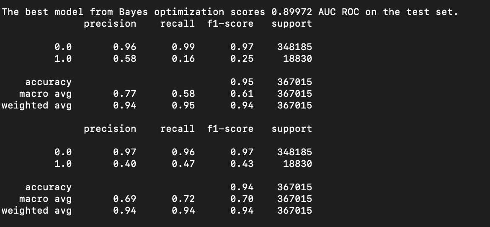

## Mortality Weekly Report (11/21)
### Rustom Ichhaporia

This week, I spent most of my time trying to run the full 150 optimization iterations that Professor Quan recommended. I tried running the scripts on a batch job on HAL, but each trial takes a full day. I discovered that the maximum number of hours the script can run is 24. On the first day, I ran a script for the entire 150, but the script only got through ~55% of its iterations. Accordingly, I attempted to run it for 70 trials the next day, but then the model only got through about 50 iterations, so I restarted it on 50 iterations the next day. Another thing that delayed my progress was the the amount of time that using the HAL website took at times; the dashboard sometimes would not load. I am not very experienced with large-scale computing, so I apologize for the long amount of time I am taking in running the full script. 

After the 50 iteration run finally completed, I saved the `Trials` object in a pickle file so that I can resume running at the same point. Today I will try to read the pickle file in a new run and resume running the rest of the trials from the point where it left off, but I think it may require 2 days worth of runs and will not finish by the time of the meeting. 

Below I have pasted the results for the first 50 trials. The first classification report is for the raw "best model", while the second is for the model with each probability increased by 0.25 (this increases the number of deaths detected, increasing the f1 score of the 1.0 class with minimal change in the f1 score of the 0.0 class). The best AUC ROC score was 0.89, which is better than the score for the model without any optimization (around 0.50), but the best f1 scores are still roughly the same at around the 0.40 mark. I am not sure if it is really best to optimize the AUC ROC here, as the minority class is will not be identified as strongly as if the f1 score is maximized. 

After finishing the model, I plan to write a method that allows the input of user data for the prediction of the age distribution of death. Please let me know if anything else is desired. I am sorry for the short length of my report, but all I have been able to do other than commenting my code is waiting for the model to complete running each time. 

Linear model of top ~20 (logistic regression)
Data cleaning, merge high level categorical, check for outliers
Various probability thresholds, list precision/f1 of distribution, find best threshold